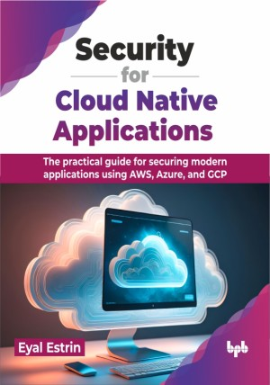

# Security for Cloud Native Applications

Your practical handbook for securing cloud-native applications

This is the repository for [Security for Cloud Native Applications
](https://bpbonline.com/products/security-for-cloud-native-applications?variant=43340846891208),published by BPB Publications.

## About the Book
Security for cloud-native applications is an overview of cloud-native application’s characteristics from a security point of view, filled with best practices for securing services based on AWS, Azure, and GCP infrastructure.

This book is a practical guide for securing cloud-native applications throughout their lifecycle. It establishes foundational knowledge of cloud services and cloud-native characteristics. It focuses on securing design approaches like APIs, microservices, and event-driven architectures. Specific technologies like containers, Kubernetes, and serverless functions are covered with security best practices. The book emphasizes integrating security throughout development using CI/CD pipelines and IaC tools. It explores policy as code for enforcing security policies and immutable infrastructure for enhanced security posture. Key management and threat detection strategies are also covered. Finally, the book offers a practical example and resources for further learning.

By the end of the book, the reader will be able to design and secure modern applications using the public cloud scale, managed services, automation, and built-in security controls.

## What You Will Learn
• How to secure modern design architectures from APIs, event-driven architectures, and microservices.

• How to secure applications using containers and the Kubernetes platform.

• How to secure applications using serverless/function-as-a-service.

• How to implement key and secrets management as part of cloud-native applications.

• How to implement the 12-factor application methodology and immutable infrastructure in cloud-native applications.
